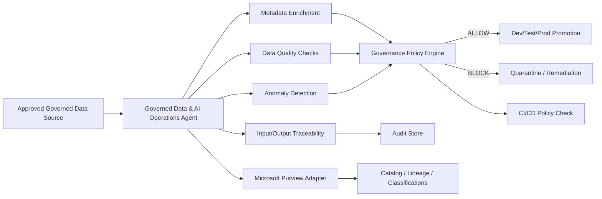

# Governed Data & AI Operations Agent

A portfolio-ready **AI agent / intelligent automation** project designed around a Senior Data Engineer role whose primary focus is **Data & AI Governance**.

Instead of building a generic chatbot, this project treats governance as part of the platform workflow. It evaluates a data product before it can move through **dev, test, and prod** and produces an auditable decision that can be consumed by **CI/CD**.

## What it demonstrates

- **Python** agent orchestration
- **SQL/PySpark-ready** data engineering pattern
- **batch / streaming governance pattern** for Azure Data Factory, Azure Databricks, Stream Analytics, Event Hubs, AWS Glue/Kinesis, or GCP Dataflow/Pub/Sub
- **medallion architecture** compatibility for Bronze/Silver/Gold data products
- **Microsoft Purview** integration boundary for cataloging, classifications, lineage, ownership, and governance results
- **AI agents / intelligent automation** for metadata enrichment
- **data quality checks** and **anomaly detection**
- restriction to **approved, governed data sources**
- **logging and auditability** using SQLite plus append-only publication logs
- **input/output traceability** with SHA-256 hashes and agent versioning
- **AI governance** through deterministic policy gates outside the LLM
- **agent lifecycle management** through explicit agent version, run ID, execution stages, and persisted run history
- **Git-based development** and **CI/CD**
- **governance and policy checks** embedded into Azure DevOps / GitHub Actions
- **infrastructure-as-code** examples with **Terraform and Bicep**
- **environment promotion paths (dev, test, prod)**

## Architecture



## Why this is an AI agent rather than a script

The workflow coordinates multiple platform actions as one governed run: it inspects the data asset, enriches metadata, evaluates data quality, detects anomalies, makes a policy decision, recommends the next action, publishes governance metadata, and records a trace of the run. The AI enrichment boundary is intentionally separated from deterministic policy enforcement so an AI-generated suggestion can never bypass governance.

## Local demo

```bash
python -m app.main --approved --lineage-registered --environment test --promotion-gate
```

Expected result: the sample data is evaluated, metadata classifications are proposed, data quality and anomaly detection are run, a governance decision is made, and the entire run is written to an audit store and result file.

To prove the policy gate works, omit `--approved`:

```bash
python -m app.main --lineage-registered --environment prod --promotion-gate
```

The agent returns a non-zero exit code and **BLOCKS** production promotion because the source is not an approved, governed data source.

## CI/CD governance

`azure-pipelines.yml` demonstrates unit tests, Data & AI Governance policy checks, audit artifacts, and production promotion only after the GovernanceGate succeeds. The repo-level GitHub Actions workflow enforces the same pattern on changes to this project.

## Databricks / PySpark path

`app/pyspark_quality.py` contains the Spark-facing profiling boundary. In Azure Databricks, the same agent can receive Spark-generated data-quality metrics from Bronze/Silver/Gold datasets while keeping the governance policy layer unchanged.

A production implementation would normally connect Azure Data Factory / Event Hubs / Stream Analytics, Azure Databricks + PySpark + Delta Lake, ADLS Gen2, Microsoft Purview, Azure OpenAI, Azure Logic Apps, Entra ID RBAC / managed identities, Azure DevOps, Terraform or Bicep.

## Microsoft Purview design

The demo uses `MockPurviewGateway` because a real Microsoft Purview tenant requires organization-specific authentication, collections, entity types, and asset identifiers. Replace the adapter with an authenticated Purview client that writes classifications, sensitivity metadata, data quality score, governance policy result, run ID, and input/output traceability hashes.

## Azure OpenAI design

`app/metadata.py` provides a safe metadata-enrichment boundary. A production Azure OpenAI implementation should return structured metadata suggestions, but **Microsoft Purview/RBAC/policy checks must remain deterministic and external to the model**.

